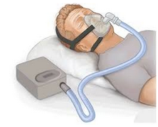

# Half Ventilators

There are 2 types of ventilation, Invasive and Non-Invasive. In the invasive method of delivery, an endotracheal tube(Tube inserted through the mouth into the trachea) is inserted and connected to a ventilator, while in the non invasive method oxygenated air is delivered through a face mask.

## Non Invasive Ventilation

This uses a silicone airtight face mask which is connected by a flexible tube to the ventilator Ventilator pumps oxygenated air, at a specific rate . Good if this pressure can be changed. Challenge is that the pumping should be synchronised with the breathing rhythm of the patient. Patient is usually awake and in control of his respiration when this method is used.

## Invasive Ventilation

This is for more serious patients when non invasive ventilation becomes inadequate.. Intubation is done (special, reusable tube that is inserted into the trachea and sealed with an inflatable bulb). Patient is usually sedated and paralysed for this procedure. In this case the ventilator decides  the volume, rate and the pressure at the end of each expiration (PEEP- Positive End Expiratory Pressure), and the doctor should be able to adjust these parameters.

## Other important points

- Doctors decide whether to use invasive or non invasive forms of ventilation.
- In case of SARS-Cov-2 infection resulting in ARDS (Acute respiratory distress syndrome), invasive method of ventilation is  - - preferred to avoid aerosolization of patient secretions .
- Same ventilator can be used for invasive and non- invasive forms of ventilation.
- Once  on a ventilator, a patient can remain on it for approx 1 - 3 weeks.
- Once on a ventilator, the doctor cannot disconnect the ventilator until the patient recovers or dies, due to ethical reasons.
- A mechanism to actuate multiple bellows can be done, assuming that there will be multiple patients requiring roughly the same - Volume and Rate setting. PEEP will be the same for all.

## Background Info

This is a portable ventilator, with the face mask connected.  The regular ones are bigger, feature rich and expensive.
